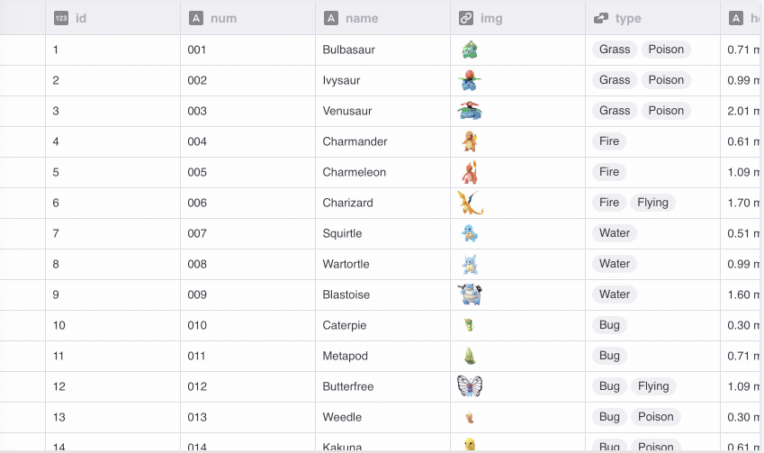

# Glide Data Grid

We built [Data Grid](https://grid.glideapps.com) as the basis for the [Glide Data Editor](https://docs.glideapps.com/all/reference/data-editor/introduction-to-the-data-editor). It's a React component built on top of HTML Canvas.



-   **It scales to millions of rows**. Cells are rendered lazily on demand for memory efficiency.
-   **Scrolling is extremely fast**. Native scrolling keeps everything buttery smooth.
-   **Supports multiple types of cells**. Numbers, text, markdown, bubble, image
-   **Fully Free & Open Source**. [MIT licensed](LICENSE) so you can use Grid in commerical projects.
-   **Editing is built in**.
-   **Resizable and movable columns**.
-   **Variable sized rows**.
-   **Single- and multi-select**.
-   **Cell rendering can be customized**.

## Installation

To add Grid to your own project:

```shell
$ npm install @glideapps/glide-data-grid
# Install peer dependencies
$ npm install direction marked react-responsive-carousel styled-components
```

## Simple usage

First you need to define your columns:

```ts
const columns: GridColumn[] = [
    { title: "Number", width: 100 },
    { title: "Square", width: 100 },
];
```

Next you need a function which, given column and row indexes, returns a cell to display. Here we have two columns, the first of which shows the index of the row, and the second the square of that number:

```ts
function getData([col, row]: readonly [number, number]): GridCell {
    let n: number;
    if (col === 0) {
        n = row;
    } else if (col === 1) {
        n = row * row;
    } else {
        throw new Error("This should not happen");
    }
    return {
        kind: GridCellKind.Number,
        data: n,
        displayData: n.toString(),
        allowOverlay: false,
    };
}
```

Now you can use Data Grid:

```jsx
<DataEditorContainer width={500} height={300}>
    <DataEditor getCellContent={getData} columns={columns} rows={1000} />
</DataEditorContainer>
```

## Full API documentation

The full [API documentation is in the `API.md` file](API.md).

## FAQ

**Nothing shows up!**

Please read the [Prerequisites section in the docs](API.md).

**It crashes when I try to edit a cell!**

Please read the [Prerequisites section in the docs](API.md).

**Does it work with screen readers and other a11y tools?**

Not yet unfortunately. This is on our todo list.

**Does it support my data source?**

Yes.

Data Grid is agnostic about the way you load/store/generate/mutate your data. What it requires is that you tell it which columns you have, how many rows, and to give it a function it can call to get the data for a cell in a specific row and column.

**Does it do sorting, searching, and filtering?**

Search is included.

Filtering and sorting are something you would have to implement with your data source. There are hooks for adding column header menus if you want that.

The reason we don't add filtering/sorting in by default is that these are usually very application-specific, and can often also be implemented more efficiently in the data source, via a database query, for example.

**Can it do frozen rows/columns?**

Not yet, but there is some infrastructure for this internally already, and we accept PRs.

**Can I render my own cells?**

Yes, but the renderer has to use HTML Canvas.

**Why does Data Grid use HTML Canvas?**

Originally we had implemented our Grid using virtualized rendering. We virtualized both in the horizontal and vertical direction using [react-virtualized](https://github.com/bvaughn/react-virtualized). The problem is simply scrolling performance. Once you need to load/unload hundreds of DOM elements per frame nothing can save you.

There are some hacks you can do like setting timers and entering into a "low fidelity" rendering mode where you only render a single element per cell. This works okay until you want to show hundreds of cells and you are right back to choppy scrolling. It also doesn't really look or feel great.
