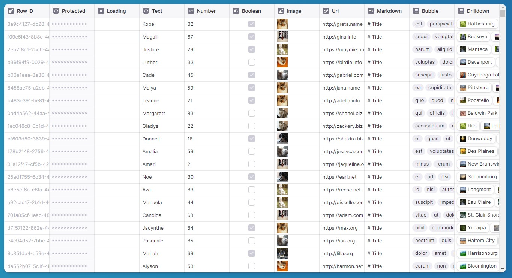

<h1 align="center">
   
  <b>Glide Data Grid Cells</b>
</h1>

Additional cells and features for Glide Data Grid

&nbsp;&nbsp;&nbsp;&nbsp;

This is still under active development and may not be useful to you yet.

Current cells

-   Star (Rating) Cell
